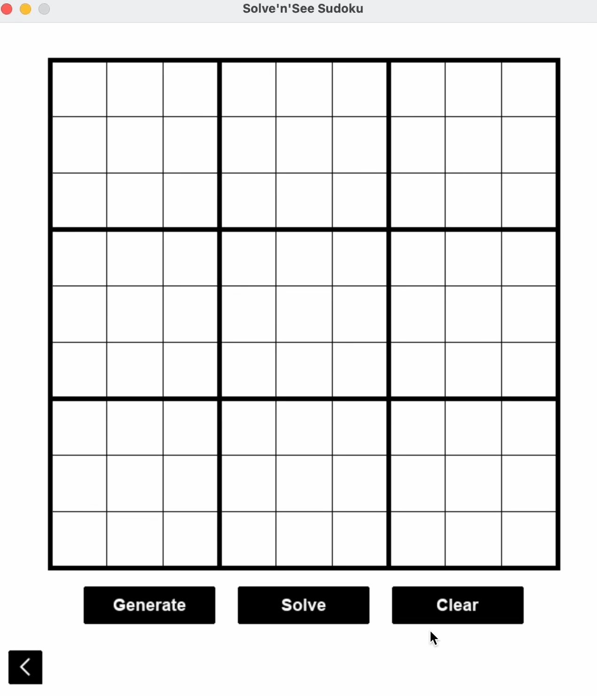

## Table of Contents


- [Table of Contents](#table-of-contents)
- [Solve'n'See Sudoku](#solvensee-sudoku)
- [Key Features](#key-features)
- [Installation/Usage](#installationusage)
- [License](#license)


## Solve'n'See Sudoku

**Solve’n’See Sudoku** is an interactive application where you can generate, play, and solve Sudoku puzzles while visualizing the solving process using the backtracking algorithm.

## Key Features

- **Visualization:** Watch the backtracking algorithm in action.

<div align="center">
    
</div>


- **Dynamic Puzzle Generation:** Play endlessly generated puzzles.

<div align="center">
    
</div>

- **Puzzle Solver:** Input custom puzzles and use the solver to find solutions or check your answers.

## Installation/Usage

The project is written in Python 3 and uses pygame for the GUI.

1. Clone the repo:
    
    ```bash
    git clone git@github.com:omarmaiteeg/Solve-n-See-Sudoku.git
    
    ```
    
2. Navigate to the `src` directory:
    
    ```bash
    cd Solve-n-See-Sudoku/src
    
    ```
    
3. Install `pygame`:
    
    ```bash
    pip install pygame
    
    ```
    
4. Run the program:
    
    ```bash
    python main.py
    
    ```

## License

This project is licensed under the terms of the MIT license.